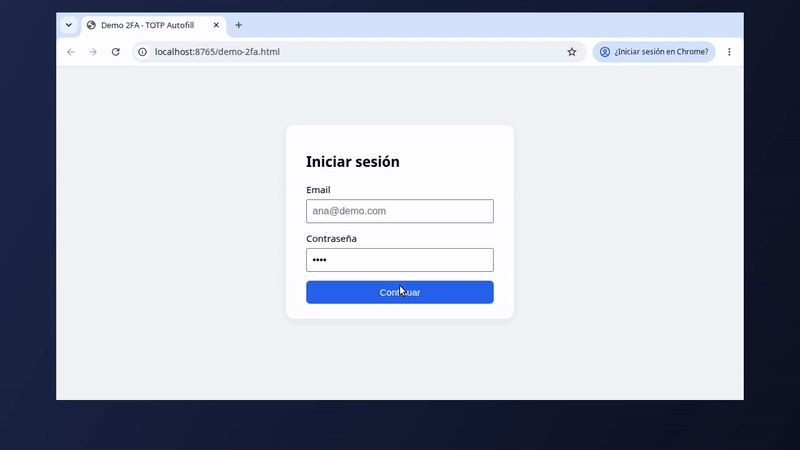
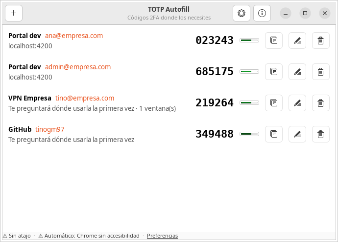
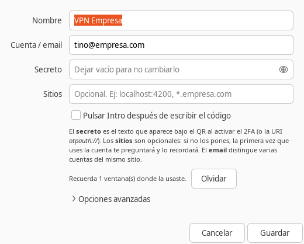
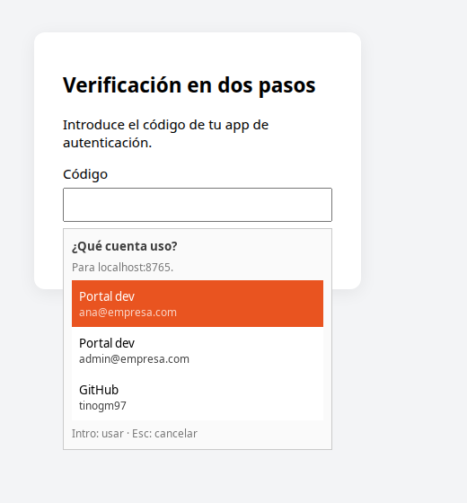
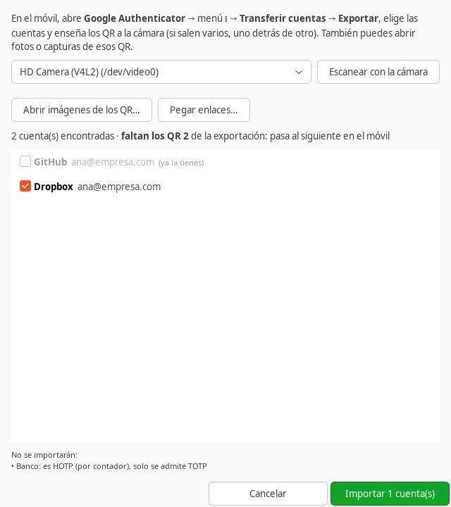
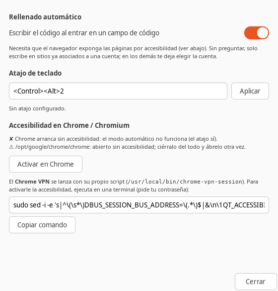

# TOTP Autofill

Aplicación de escritorio para **Ubuntu** que **escribe tus códigos 2FA (TOTP)
en el campo donde estés**, sin mirar el móvil y **sin extensiones de
navegador ni URLs que configurar**:

- **Automático:** al entrar en el campo del código de una web, se escribe solo.
- **Con un atajo:** pon el cursor en el campo y pulsa **`Ctrl+Alt+2`**. Funciona
  en cualquier aplicación, no solo en el navegador.

[](docs/demo.mp4)

▶️ **[Ver el vídeo demo completo (1 minuto)](docs/demo.mp4)**: la app, la
importación desde Google Authenticator con la webcam, el relleno automático,
el selector de cuenta y el atajo de teclado.



- 📥 **Importa todas tus cuentas de Google Authenticator** de una vez, con la
  webcam o con fotos de los QR de exportación.
- 🔐 **Secretos en el llavero de GNOME** (libsecret), nunca en texto plano.
- 🧠 **Aprende dónde usas cada cuenta**: la primera vez te pregunta cuál es y
  la recuerda para ese sitio (o esa ventana).
- 👥 **Varias cuentas en el mismo sitio** (p. ej. usuarios de prueba en
  `localhost:4200`): usa la del email con el que inicias sesión.
- 🛡️ **Nunca escribe sin preguntar en un sitio desconocido.**
- 🧩 **Sin dependencias externas**: Python 3, GTK 3, AT-SPI y XTest del sistema.

> ⚠️ **Aviso de seguridad:** tener el segundo factor en el mismo ordenador que
> la contraseña debilita el 2FA. Úsalo en tu equipo personal, con disco
> cifrado y sesión bloqueada, y conserva el secreto también en el móvil. Ver
> [Seguridad](#seguridad).

---

## Índice

1. [Instalación](#instalación)
2. [Primeros pasos](#primeros-pasos)
3. [Importar desde Google Authenticator](#importar-desde-google-authenticator)
4. [Cómo elige la cuenta](#cómo-elige-la-cuenta)
5. [Modo automático y Chrome](#modo-automático-y-chrome)
6. [El atajo de teclado](#el-atajo-de-teclado)
7. [Línea de comandos](#línea-de-comandos)
8. [Seguridad](#seguridad)
9. [Solución de problemas](#solución-de-problemas)
10. [Cómo funciona](#cómo-funciona)
11. [Desarrollo](#desarrollo)
12. [Desinstalar](#desinstalar)

---

## Instalación

Con un solo comando, sin clonar el repositorio ni usar `sudo`:

```bash
curl -fsSL https://raw.githubusercontent.com/tinogm97/totp-autofill/main/get.sh | bash
```

Volver a ejecutarlo **actualiza** a la última versión. El instalador:

| Qué hace | Dónde |
|---|---|
| Instala la app y el comando `totp-autofill` | `~/.local/share/totp-autofill/`, `~/.local/bin/` |
| Añade la app al menú de aplicaciones | `~/.local/share/applications/` |
| Arranca el proceso en segundo plano y lo añade al inicio de sesión | `~/.config/autostart/` |
| Registra el atajo **`Ctrl+Alt+2`** (GNOME) | Ajustes → Teclado → Atajos personalizados |
| Crea un lanzador de Chrome con accesibilidad (para el modo automático) | `~/.local/share/applications/google-chrome.desktop` |

Si no quieres alguna de las dos últimas cosas:
`… | bash -s -- --no-shortcut` o `--no-chrome` (o desde un clon:
`./install.sh --no-chrome`).

<details>
<summary>Requisitos y otras formas de instalar</summary>

Ubuntu 22.04/24.04 con sesión **X11** (ver [Wayland](#uso-con-wayland)) y los
paquetes de sistema, que vienen de serie en Ubuntu Desktop:

```bash
sudo apt install python3-gi gir1.2-gtk-3.0 gir1.2-secret-1 gir1.2-atspi-2.0 \
                 at-spi2-core libxtst6 gnome-keyring libnotify-bin
```

```bash
# Una versión concreta, o la rama main
curl -fsSL https://raw.githubusercontent.com/tinogm97/totp-autofill/main/get.sh | bash -s -- --version v2.0.0
curl -fsSL https://raw.githubusercontent.com/tinogm97/totp-autofill/main/get.sh | bash -s -- --main

# Revisar el script antes de ejecutarlo
curl -fsSLO https://raw.githubusercontent.com/tinogm97/totp-autofill/main/get.sh && less get.sh && bash get.sh

# Desde una copia del repositorio
git clone https://github.com/tinogm97/totp-autofill.git && cd totp-autofill && ./install.sh
```

</details>

Comprueba que todo está listo:

```bash
totp-autofill status
```

```
✔ Teclear en X11 (XTest)
✔ Proceso en segundo plano (totp-autofill daemon)
✔ Atajo de teclado: Ctrl+Alt+2
✔ Lanzador de Chrome con accesibilidad
   ✔ /opt/google/chrome/chrome: modo automático disponible
```

## Primeros pasos

> ¿Usas **Google Authenticator**? Sáltate los pasos 1 y 2 e
> [impórtalas todas de una vez](#importar-desde-google-authenticator).

### 1. Consigue el secreto TOTP

Al activar el 2FA en un servicio te muestran un QR. Junto a él casi siempre
hay un enlace **"¿No puedes escanear el código?"** o **"Introducir la clave
manualmente"** que muestra el **secreto** (algo como `JBSW Y3DP EHPK 3PXP`).
También sirve la URI completa `otpauth://totp/...`.

> Escanea el QR con el móvil **y** guarda el secreto aquí: ambos generan los
> mismos códigos y tienes respaldo. Si ya tenías el 2FA activado, busca
> "cambiar app de autenticación" en los ajustes de seguridad del servicio.

### 2. Añade la cuenta

Abre **TOTP Autofill** desde el menú y pulsa **+**:



| Campo | Descripción |
|---|---|
| **Nombre** | Descriptivo, p. ej. `Portal dev`. |
| **Cuenta / email** | Con el que inicias sesión. Distingue varias cuentas del mismo sitio. |
| **Secreto** | Base32 o URI `otpauth://` (rellena sola el resto). |
| **Sitios** | *Opcional.* `localhost:4200`, `github.com`, `*.empresa.com`… Si lo dejas vacío, te preguntará la primera vez y lo aprenderá. |
| **Pulsar Intro** | Envía el formulario tras escribir el código. |

### 3. Úsala

- **Con Chrome reiniciado** (ver [modo automático](#modo-automático-y-chrome)):
  entra en la página del código. Se escribe solo o, si es la primera vez en ese
  sitio, te pregunta qué cuenta es:

  

- **En cualquier otro sitio:** pon el cursor en el campo y pulsa `Ctrl+Alt+2`.

## Importar desde Google Authenticator

Pulsa el botón **Importar** (junto al **+**) en la app:



1. En el móvil: **Google Authenticator** → menú **⋮** → **Transferir cuentas** →
   **Exportar** → elige las cuentas → **Siguiente**. Aparecen uno o varios QR.
2. En el ordenador: **Escanear con la cámara** y enseña cada QR a la webcam
   (si hay varios, pasa al siguiente en el móvil; la app te dice cuáles faltan).
3. Revisa la lista (las que ya tienes salen desmarcadas) y pulsa **Importar**.

Las cuentas importadas no necesitan configuración: la primera vez que uses
cada una te preguntará en qué sitio va y lo recordará.

- En **Android** Google Authenticator no deja hacer capturas de esa pantalla:
  usa la cámara del ordenador, o haz una foto con otro dispositivo y ábrela con
  **Abrir imágenes de los QR…**.
- Si tu portátil tiene dos cámaras con el mismo nombre (normal e infrarroja),
  elige la otra en la lista si la imagen sale oscura.
- También vale pegar enlaces `otpauth-migration://` u `otpauth://` (**Pegar
  enlaces…**) o, desde la terminal: `totp-autofill import foto1.jpg foto2.jpg`.
- No se importan las cuentas HOTP (por contador) ni MD5; la app lo indica.
- **Borra después las fotos o capturas de los QR**: contienen todos tus
  secretos. Las cuentas siguen también en el móvil (exportar no las borra).

Necesita `libzbar0` (lectura de QR) y, para la cámara, GStreamer con
`gstreamer1.0-gtk3`; en Ubuntu Desktop suelen venir instalados. Si no:
`sudo apt install libzbar0 gir1.2-gstreamer-1.0 gir1.2-gst-plugins-base-1.0 gstreamer1.0-gtk3 gstreamer1.0-plugins-good`.

## Cómo elige la cuenta

1. **Por el sitio** (host de la página, solo con accesibilidad). Si hay varias
   cuentas para ese sitio, por el **email** que escribiste al iniciar sesión
   (aunque el código se pida en otra página) o por el que aparezca en la
   página ("Código para ana@…").
2. **Por la ventana** donde ya la usaste (título), cuando no hay accesibilidad.
3. **Si solo tienes una cuenta**, esa (solo con el atajo).
4. Si no puede decidir, **te pregunta** con la lista (las más probables
   primero) y **recuerda** la respuesta: el sitio si lo conoce, o el título de
   la ventana.

El modo automático **solo escribe sin preguntar** si decidió por el sitio (1):
el título de una ventana lo controla la propia página y podría imitarse.

Las asociaciones aprendidas se ven y editan en cada cuenta (**Sitios**) y las
ventanas aprendidas se pueden olvidar desde el mismo diálogo.

### Varias cuentas en el mismo sitio

Típico de desarrollo: `localhost:4200` con varios usuarios de prueba.

```bash
totp-autofill add "Portal dev" --user ana@empresa.com   --site localhost:4200
totp-autofill add "Portal dev" --user admin@empresa.com --site localhost:4200 --auto-submit
```

Inicia sesión con `admin@empresa.com` y, al llegar al código, se escribe el de
esa cuenta. Si entras con un email que no es de ninguna cuenta, pregunta.

> Para reconocer el email, lee lo que escribes en campos de usuario/email,
> **solo lo recuerda si coincide con una cuenta configurada** y solo en memoria
> (10 minutos). Nunca lee campos de contraseña.

## Modo automático y Chrome

El modo automático usa la **accesibilidad** (AT-SPI, lo mismo que los lectores
de pantalla) para saber en qué campo estás y en qué página. Chrome solo la
activa si arranca con `--force-renderer-accessibility` **y** la variable
`QT_ACCESSIBILITY=1`. El instalador crea un lanzador de Chrome para tu usuario
con ambas cosas; **cierra Chrome del todo y vuelve a abrirlo** desde el menú o
el dock.

También puedes activarlo o desactivarlo en **Preferencias**:



o con `totp-autofill setup-chrome` / `totp-autofill setup-chrome --undo`.

**Chrome lanzado por un script** (p. ej. un Chrome aparte para la VPN con
`--user-data-dir`): hay que añadir el flag y la variable en ese script. Para
`/usr/local/bin/chrome-vpn-session`, Preferencias y `totp-autofill status`
muestran el comando exacto (`sudo sed …`).

> La accesibilidad hace que Chrome gaste algo más de memoria y CPU. Si no
> quieres activarla, el **atajo** funciona igual sin ella (eligiendo por la
> ventana en vez de por el sitio).

## El atajo de teclado

`Ctrl+Alt+2` ejecuta `totp-autofill fill`: escribe el código en el campo con el
foco, en cualquier aplicación (navegador, cliente VPN, terminal…). Cámbialo en
Preferencias, con `totp-autofill setup-shortcut --binding '<Super>o'` o en
Ajustes → Teclado → Atajos de teclado → Atajos personalizados.

En escritorios que no son GNOME, crea un atajo que ejecute
`~/.local/bin/totp-autofill fill`.

## Línea de comandos

```bash
totp-autofill                        # abre la app
totp-autofill status                 # comprueba que todo está listo
totp-autofill list                   # lista las cuentas
totp-autofill add "GitHub" --user tino --site github.com --auto-submit
                                     # pide el secreto sin mostrarlo
totp-autofill add "VPN" --uri "otpauth://totp/Empresa:yo?secret=...&issuer=Empresa"
totp-autofill import captura1.png captura2.jpg   # exportación de Google Authenticator
totp-autofill import "otpauth-migration://offline?data=..."
totp-autofill code GitHub            # 123456  (válido 17s)
totp-autofill code ana@empresa.com   # también por email
totp-autofill delete GitHub
totp-autofill fill                   # lo que hace el atajo
totp-autofill daemon --debug         # ver qué detecta y decide (nunca muestra códigos)
totp-autofill setup-chrome [--undo]
totp-autofill setup-shortcut [--binding '<Control><Alt>2' | --remove]
```

## Seguridad

**Qué protege:**

- Los secretos están en el **llavero del sistema**. `accounts.json` solo tiene
  nombres, emails, sitios y títulos de ventana, con permisos `600`.
- En modo automático **solo escribe sin preguntar si el sitio de la página** (lo
  aporta el navegador, no la página) está asociado a la cuenta. En un sitio
  desconocido pregunta, así que una web de phishing no recibe el código sin tu
  intervención.
- El email que escribes solo se recuerda si es de una cuenta configurada, en
  memoria. Los campos de contraseña nunca se leen.
- Los registros de depuración nunca incluyen códigos ni secretos.

**Qué no protege:**

- Quien tenga tu sesión **desbloqueada** puede generar códigos.
- Un malware con tu usuario puede leer el llavero o simular pulsaciones.
- Si eliges una cuenta en el selector estando en una web falsa, el código se
  escribe en ella: fíjate en el sitio que muestra el selector.
- Debilita el 2FA si la contraseña también está guardada en el mismo equipo.

## Solución de problemas

Empieza siempre por `totp-autofill status`.

**El modo automático no hace nada.**
- `status` debe mostrar tu Chrome con ✔. Si sale ✘, ciérralo del todo (también
  en segundo plano: `pkill chrome`) y ábrelo desde el menú.
- Mira qué detecta: `pkill -f "totp_autofill daemon"; totp-autofill daemon --debug`
  y entra en el campo. Deberías ver `foco en campo …` y `campo de código`.
- Si el campo no parece de código (sin etiqueta ni `maxlength`), usa el atajo.

**El atajo no hace nada.** Comprueba en Ajustes → Teclado → Atajos
personalizados que existe "TOTP Autofill" y que otro programa no usa ya esa
combinación. Prueba `totp-autofill fill` desde una terminal con el foco en un
campo de texto.

**Escribe el código de otra cuenta.** Ábrela en la app y revisa **Sitios** y
las ventanas aprendidas (botón **Olvidar**).

**"No hay secreto en el llavero".** El llavero está bloqueado o se reinició.
Ábrelo en *Contraseñas y claves* (Seahorse) y vuelve a introducir el secreto.

### Uso con Wayland

En Wayland las aplicaciones no pueden simular teclas ni ver otras ventanas.
TOTP Autofill **copia el código al portapapeles** y avisa con una notificación
para que lo pegues con `Ctrl+V`. Para la experiencia completa, elige
"Ubuntu en Xorg" en la pantalla de inicio de sesión.

## Cómo funciona

```
      Chrome (con accesibilidad)                 totp-autofill daemon
 ┌─────────────────────────────────┐   AT-SPI  ┌───────────────────────────────┐
 │ foco en <input> "Código"        ├──────────►│ ¿campo de código?  (detect)   │
 │ URL: http://localhost:4200/...  │           │ ¿qué cuenta?       (resolver) │
 │ email escrito: ana@empresa.com  │           │   sitio / email / ventana     │
 └─────────────────────────────────┘           │   o pregunta (picker)         │
              ▲                                 │ secreto ← llavero → TOTP      │
              │   XTest: teclea "123456" ⏎      │                               │
              └─────────────────────────────────┤ teclea (x11)                  │
 Ctrl+Alt+2 → totp-autofill fill ──D-Bus──────►│ acción "fill"                 │
                                                └───────────────────────────────┘
```

Detalle en [docs/ARQUITECTURA.md](docs/ARQUITECTURA.md).

## Desarrollo

```
totp-autofill/
├── totp_autofill/
│   ├── totp.py           # RFC 6238 + parser otpauth://
│   ├── store.py          # cuentas, sitios, preferencias, llavero
│   ├── detect.py         # ¿es un campo de código? ¿de usuario?
│   ├── resolver.py       # qué cuenta usar según el contexto
│   ├── a11y.py           # lectura de páginas por AT-SPI
│   ├── x11.py            # ventana activa y pulsaciones XTest (ctypes)
│   ├── filler.py         # escribir el código (o portapapeles en Wayland)
│   ├── picker.py         # selector de cuenta
│   ├── daemon.py         # proceso en segundo plano + acción del atajo
│   ├── chrome_setup.py   # lanzador de Chrome con accesibilidad
│   ├── keybinding.py     # atajo de GNOME
│   ├── migration.py      # exportación de Google Authenticator (protobuf)
│   ├── qr.py / camera.py # lectura de QR (libzbar) y webcam (GStreamer)
│   ├── import_dialog.py  # ventana de importación
│   ├── gui.py / cli.py   # interfaz gráfica y línea de comandos
│   └── icons/            # icono de la app (PNG 16–512 px y SVG)
├── examples/demo-2fa.html  # página demo (varios usuarios, 6 cajas, multipágina)
├── tests/                  # unitarios y e2e
├── data/                   # plantillas .desktop (menú y autoarranque)
├── scripts/make_icons.py
├── get.sh                  # instalador remoto (curl | bash)
└── install.sh / uninstall.sh
```

```bash
python3 -m totp_autofill                  # GUI sin instalar
python3 -m unittest discover -s tests -v  # tests unitarios
tests/e2e/run.sh                          # test end-to-end (ver abajo)
```

El **test end-to-end** abre un Chromium real con la página demo, arranca el
daemon y maneja la página como una persona (clics y teclado) para comprobar
que llega el código correcto: dos usuarios en el mismo sitio, 6 cajas,
multipágina, selector, atajo con y sin daemon, aprendizaje por ventana y
lectura de un QR de exportación con una cámara simulada. Se
ejecuta en una sesión aislada (Xvfb, D-Bus y accesibilidad propios, `HOME`
temporal y secretos en un fichero temporal): no toca tu escritorio ni tu
llavero. Necesita `xvfb`, `at-spi2-core` y un Chromium
(`npx playwright install chromium` o `CHROME=/ruta tests/e2e/run.sh`).

Regenerar el vídeo demo (`docs/demo.mp4` y `docs/demo.gif`): `scripts/demo/run.sh`.
Graba cada escena en una sesión aislada con cuentas falsas y una cámara
simulada, y la monta con `ffmpeg` (necesita `xvfb`, `ffmpeg` y Google Chrome).

Probar la demo a mano:

```bash
python3 -m http.server 8765 --directory examples
totp-autofill add "Demo" --user ana@demo.com  --site localhost:8765 --secret JBSWY3DPEHPK3PXP --auto-submit
totp-autofill add "Demo" --user luis@demo.com --site localhost:8765 --secret GEZDGNBVGY3TQOJQ --auto-submit
# abre http://localhost:8765/demo-2fa.html (?split=1 → 6 cajas, ?multipage=1 → otra página)
```

## Desinstalar

```bash
~/.local/share/totp-autofill/uninstall.sh           # quita la app, el atajo y el lanzador de Chrome
~/.local/share/totp-autofill/uninstall.sh --purge   # además borra cuentas y secretos
```

## Licencia

[MIT](LICENSE) © Celestino Armando García Meca
